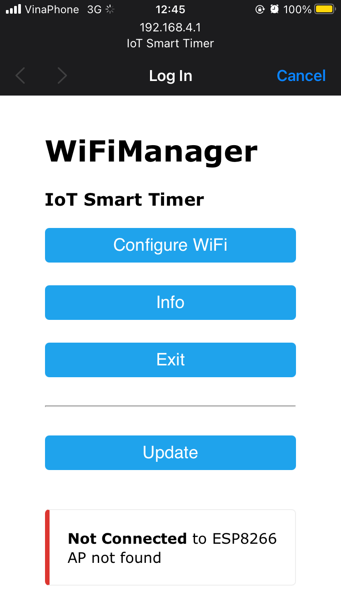
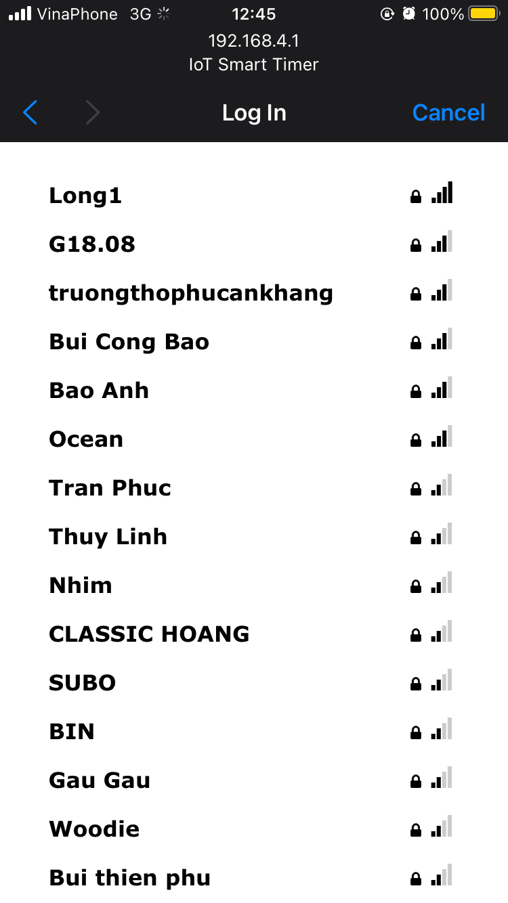
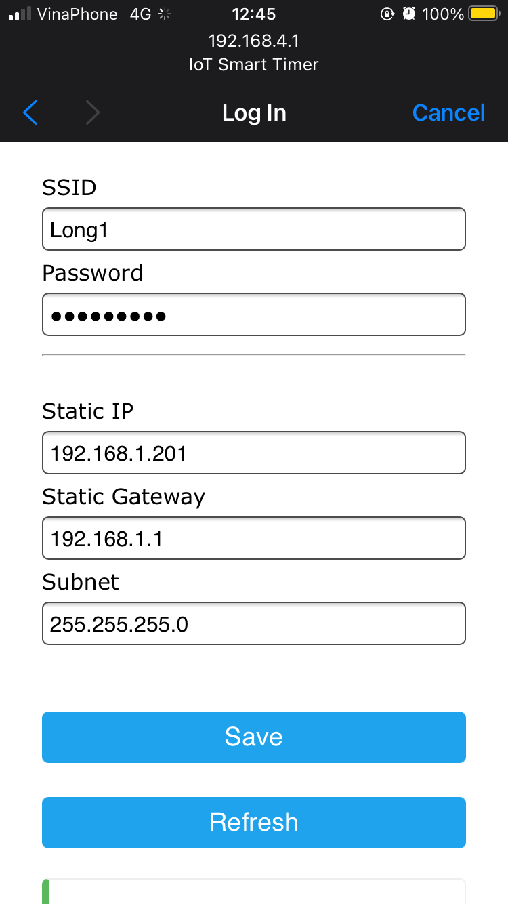
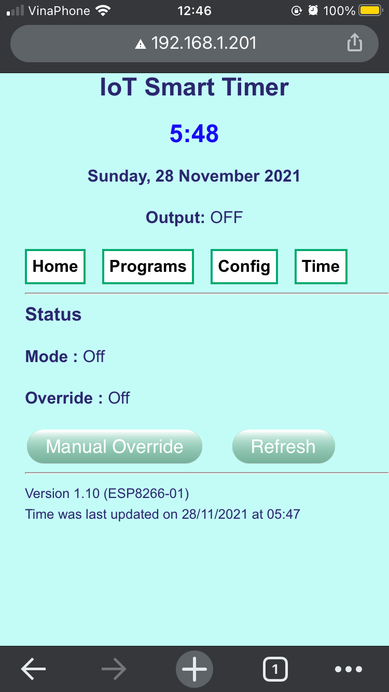

# Timer Pumper

## Library installation

1. TimeLib
    1. Go to Manage Libraries
        ```
        Sketch > Include Library > Manage Libraries... 
        ```
    1. Search by the keyword `TimeLib`, then install the package `Time` by `Paul functionality for arduino`.
1. WiFiManager
    1. Download zip file from github repo [tzapu/WiFiManager](https://github.com/tzapu/WiFiManager)
    1. `Sketch > Include Library > Zip file` select the downloaded zip file to install

## Open file `timer-pumber.ino` in Arduino

## Select correctly board module and port

1. Tools > Boards > ESP8266 Board > Generic ESP8266 Module
2. Tools > Port

## Build and upload

1. Click on Verify button at the menu
2. After verifed, click on button Upload at the menu and waiting for Upload Done status

## Settup for Wifi

1. Reset board by break the power source
2. Using your phone or laptop find and connect to the wifi named `IoT Smart Timer`
3. After wifi was connected, a web page will display as below

4. Chose `Configure WiFi`

5. Input for Wifi Password and IP Address information

6. Access to control page from the web browser via the inputed Static IP.

